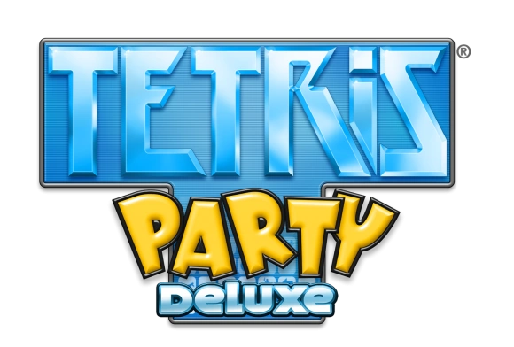

# Tetris Party Patch

Play **Tetris Party Deluxe** (Wii) and **Tetris Party Premium** (Japan) with
**GameCube controllers** in ports 1-4, mapped to the game's native Classic
Controller support so no physical Classic Controller is needed. Works with the
USA (`STEETR`), European (`STEPTR`) and Japanese (`STEJ18`) releases.

The patch is applied to your own copy of the game: drop a clean `.wbfs` or
`.iso` onto the patcher and play the result on a Wii (USB loader) or in
Dolphin. Nothing from the game is included in this repository.



## Status

The patch is built for all three releases. **Not yet tested on a real Wii** -
see [On a real Wii](#on-a-real-wii).

**Known limits:**

- plug the GameCube controller in **before** starting the game; port *n*
  drives player *n*
- analog triggers count as pressed past 50, and the control stick acts as a
  direction past 48

## Controls

The patch bridges GameCube input into the Classic Controller samples the game
already reads (`WPADStatus` ring buffer). Port *n* controls player *n*.

| GameCube Input | Classic Controller Action | Game Action |
| --- | --- | --- |
| Control Stick / D-Pad Left | D-Pad Left / Analog Stick | Move Tetramino Left · Menu Left |
| Control Stick / D-Pad Right | D-Pad Right / Analog Stick | Move Tetramino Right · Menu Right |
| Control Stick / D-Pad Down | D-Pad Down / Analog Stick | Soft Drop · Menu Down |
| Control Stick / D-Pad Up | D-Pad Up / Analog Stick | Hard Drop · Menu Up |
| A | A | Rotate Clockwise · Confirm / Select |
| B | B | Rotate Counter-Clockwise · Cancel / Back |
| X | X | Rotate Clockwise |
| Y | Y | Rotate Counter-Clockwise |
| L (Digital or Analog > 50) | L / ZL | Hold Piece · Use Item |
| R (Digital or Analog > 50) | R / ZR | Hold Piece · Use Item |
| Start | + | Pause Menu |
| Z | HOME | Wii HOME Menu |

## Installing

### Patch your disc image

You need a clean `.wbfs` or `.iso` of the game. Download the patcher for your
system from the releases page (or the artifacts of the latest CI run), or run
it from source (needs Python 3 with tkinter and
[Wiimms ISO Tool](https://wit.wiimm.de/) (`wit`) on your `PATH`):

```bash
python3 tools/gui.py
```

Drop the image onto the window (or click to choose it). The patcher checks the
disc id and `sys/main.dol`, patches it, rebuilds the image in the same format
and replaces your file, keeping the original next to it as `<name>.bak`. Other
releases, and images already modified by something else, are refused rather
than corrupted.

There is a command-line twin:

```bash
python3 tools/patch_disc.py "Tetris Party Deluxe (USA).wbfs" --gc
```

### Gecko codes (Dolphin)

Copy `codes/<disc id>.ini` (`STEETR`, `STEPTR` or `STEJ18`) into Dolphin's
`GameSettings` folder and enable **GameCube controllers** under
**Properties -> Gecko Codes**. Set GameCube Port 1 (and 2-4 for multiplayer) to
a Standard Controller.

The same codes are in `codes/<disc id>.txt` in the plain layout loaders such as
USB Loader GX and WiiFlow read.

### Riivolution

`riivolution/<disc id>.xml` is a Riivolution patch. Put it in your Riivolution
folder (or Dolphin's `Load/Riivolution`) and enable it. It matches on the disc
id and version, so it cannot be applied to the wrong release.

### Which release do I have?

The disc id is the first six characters of the disc:

| Release | Disc ID | Version | Clean DOL size |
| --- | --- | --- | --- |
| USA | `STEETR` | v0 | 5,010,592 bytes |
| Europe | `STEPTR` | v0 | 5,013,280 bytes |
| Japan | `STEJ18` | v0 | 5,093,536 bytes |

`python3 tools/patch_disc.py` and the GUI read it for you; the Gecko and
Riivolution files are named by it.

## On a real Wii

- Play the patched image from a USB loader as usual
  (`wbfs/<Title> [STEETR]/STEETR.wbfs`). Turn the loader's **cheats / debugger
  off** for this game when using the patched image.
- Connect the GameCube controller **before** launching the game.

## Building from source

The patcher needs only Python 3 and `wit`. The routine it injects ships
pre-assembled in `tools/prebuilt/`; with [devkitPPC](https://devkitpro.org/)
and your own `main.dol` dumps you can rebuild it from `src/`:

```bash
TP_DOLS=/dir/with/dumps python3 tools/gen_prebuilt.py
python3 tools/build.py        # regenerate codes/ and riivolution/
python3 tools/check.py        # consistency checks (no game files needed)
```

How the patch works is in [docs/TECHNICAL.md](docs/TECHNICAL.md).

## Contact

quatricsoftware@gmail.com

No support will be provided for this tool.

## License

MIT - see [LICENSE](LICENSE).

Copyright (c) 2026 quatric

### Modded images

Disc patchers match the first four characters of the game ID (ID4), so mods can change the last two characters. The original disc ID and filename are preserved. Revision and executable patch-site checks still apply; mods that change required code may be incompatible.
